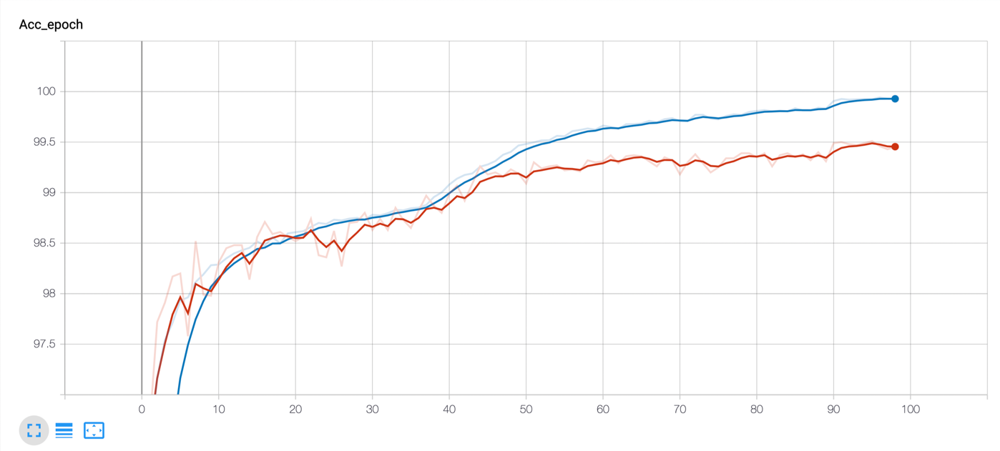
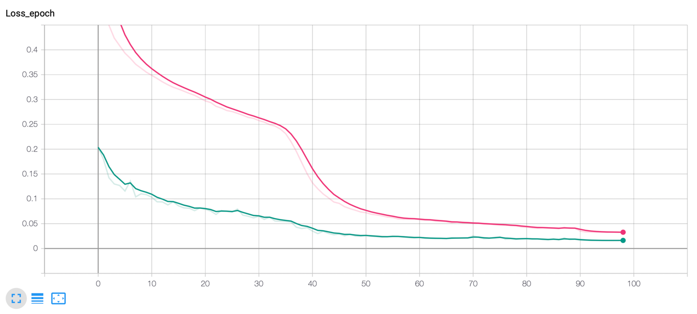
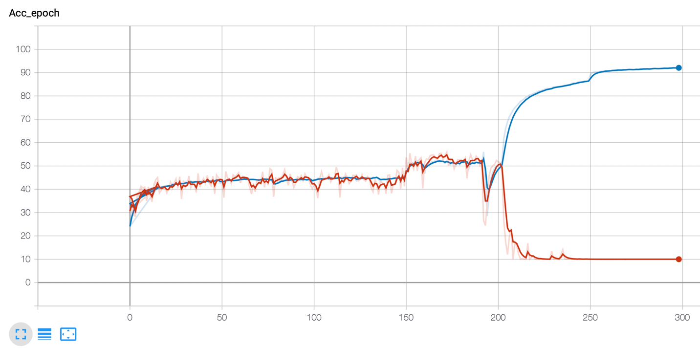

This is the implementation of our paper [Adversarial Defense via Local Flatness Regularization](https://ieeexplore.ieee.org/abstract/document/9191346), accepted by the IEEE International Conference on Image Processing (ICIP) 2020. This project is developed based on Python 3.7, created by Jia Xu and Yiming Li.

## Citation 
If our work is useful for your research, please cite our paper as follows:
```
@inproceedings{xu2020adversarial,
  title={Adversarial defense via local flatness regularization},
  author={Xu, Jia and Li, Yiming and Jiang, Yong and Xia, Shu-Tao},
  booktitle={2020 IEEE International Conference on Image Processing (ICIP)},
  pages={2196--2200},
  year={2020},
  organization={IEEE}
}
```

## Install Pre-requisites

```angular2html
pip install -r requirements.txt
```
## Pretrained Models
The pretrained models are saved in the folder
`savedModel`
## LFR Training
### Training on MNIST
Run the command below to start the training process on MNIST and save the model to the directory `--save_dir`.
```angular2html
python MNIST_defense.py --dataset MNIST --epochs 100 --lr 0.01 --gamma 0.1 --train_batch 128 --norm 'l_inf' --epsilon 0.3 --step_size 0.01 --num_steps 40 --lambada 0.02 --gpu_id 1 --save_dir SavedModels
```
Use tensorboard to observe the accuracy and loss
#### Accuracy Curve

Blue Line: Train Acc; 
Red Line: Test Acc
#### Loss Curve

Pink Line: Train Loss; 
Green Line: Test Loss
### Training on CIFAR10
```angular2html
python cifar_defense.py -a resnet --depth 20 --epochs 300 --schedule 150 250 --lambada 0.03 --gpu_id 3 --save_dir SavedModels
```
#### Accuracy Curve
We can observe that the training accuracy rises rapidly while the test accuracy drops precipitously at epoch 200 . 

We think the reason is probably that the second derivative of the neural network with ReLU activation does not exist.
## Evaluation
Run the commnad to test the performance of our LFR model. Choose different attack method using `--attack_method`.
We use the pretrained model in the folder `savedModel`
### Evaluating on MNIST
```angular2html
python MNIST_eval.py --model_path savedModel/MNIST/lr_0.01_lambada_0.02_rs_1000/model_best.pth.tar --attack_method PGD
```
### Evaluating on CIFAR10
```angular2html
python cifar_eval.py --model_path savedModel/CIFAR10/lr_0.1_lambada_0.03/model_best.pth.tar --attack_method PGD
```

